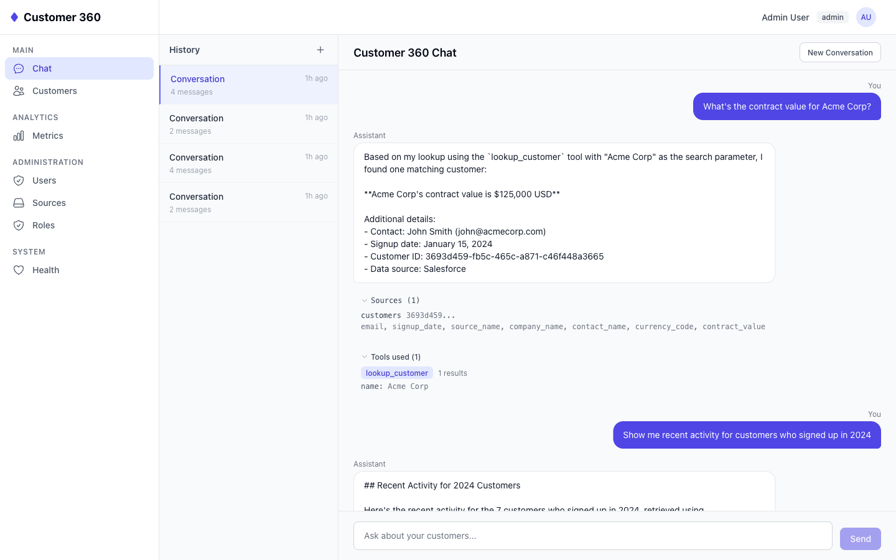
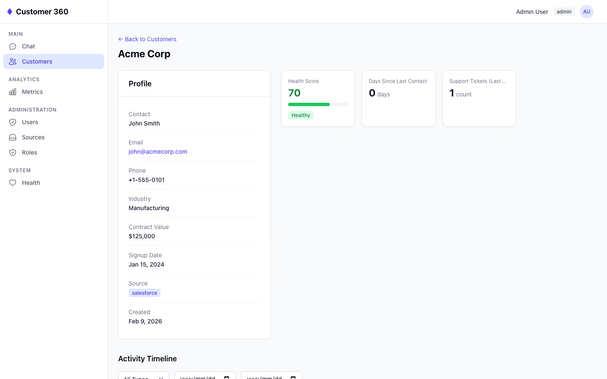
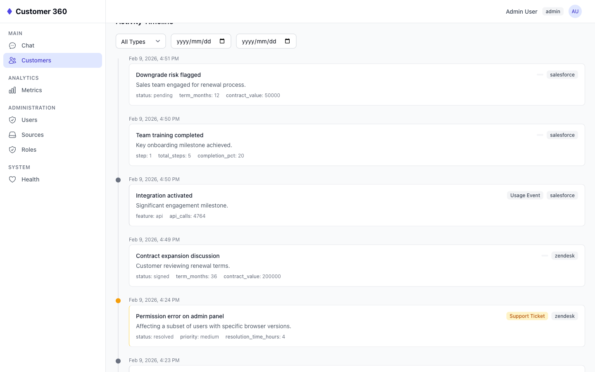
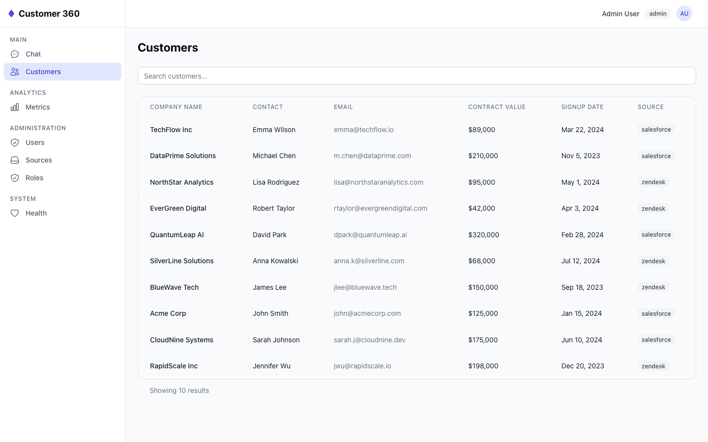
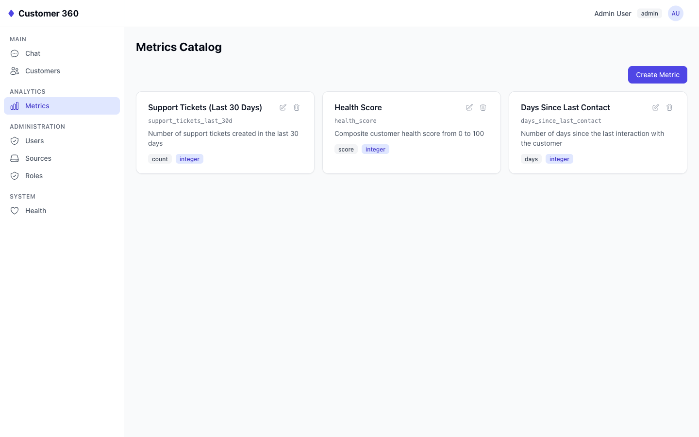
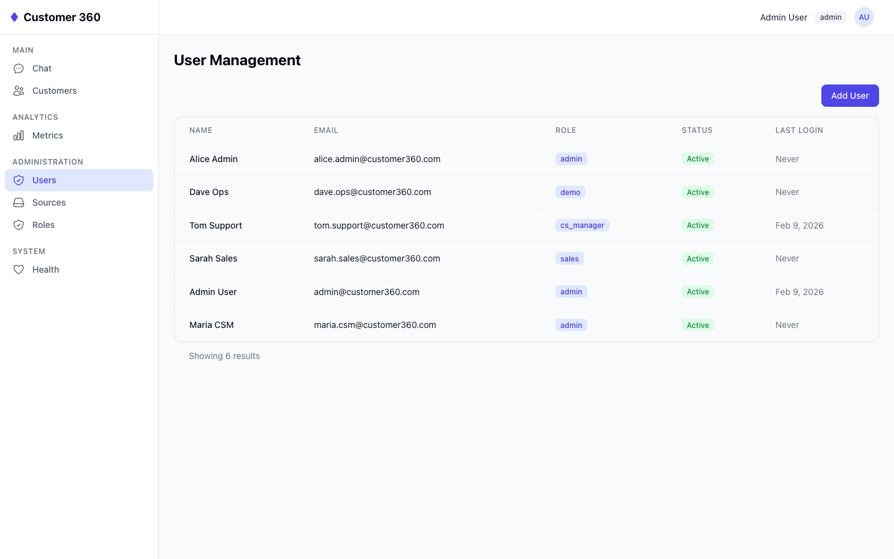
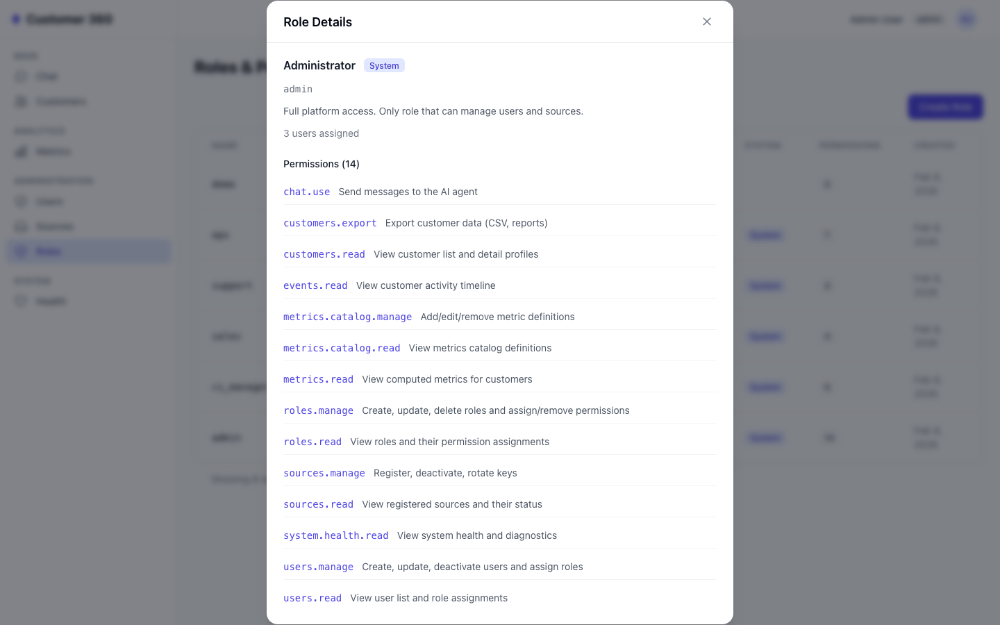
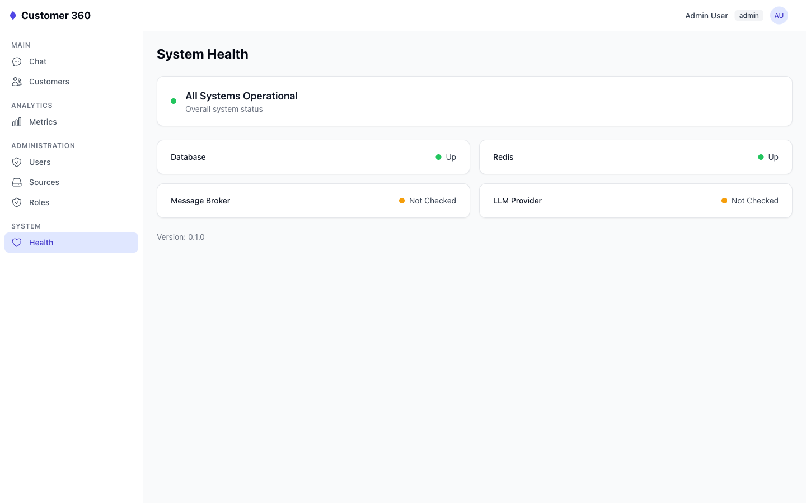

# Customer 360 Insights Agent

A small-scale "Customer 360" system that aggregates data from multiple sources and exposes it through an AI-powered conversational interface. Ask natural language questions about your customers and get answers grounded in real data — with source citations.

## How This Was Built

This entire codebase — backend, frontend, workers, infrastructure, tests — was built using **100% AI-assisted coding**. I did not write a single line of code by hand.

My role was **technical leader and solution architect**: I designed the system architecture, defined the contracts and behavior specs (see [`contracts/v1/`](./contracts/v1/)), wrote the implementation guidelines, and reviewed every piece of generated code. The AI handled all code generation, while I made every architectural decision, caught issues during review, and directed the implementation sequence.

The thinking behind each design choice is documented in [`SOLUTION_BRIEF.md`](./SOLUTION_BRIEF.md). The full technical design is in [`ARCHITECTURE.md`](./ARCHITECTURE.md).

## Screenshots

### AI Chat with Source Attribution
Ask natural language questions and get answers grounded in real data, with full transparency into which tools were called and which database records were used.



### Customer 360 Profile
Full customer profile with health score, metrics cards, contact details, and contract info — all in one view.



### Activity Timeline
Chronological event stream with type filtering and date range selection. Events are color-coded by type (support tickets, meetings, usage events).



### Customer List & Search
Searchable customer table with key fields at a glance — contact, email, contract value, signup date, and data source.



### Metrics Catalog
Self-describing metric definitions that the AI agent discovers dynamically. Admins can create, edit, and delete metrics.



### Administration
User management with role assignments, data source registry, role & permission configuration, and system health dashboard.

| Users | Roles | System Health |
|:---:|:---:|:---:|
|  |  |  |

> All 16 screenshots are in the [`screenshots/`](./screenshots/) folder.

## Quick Start

### Prerequisites

- Docker & Docker Compose
- An [Anthropic API key](https://console.anthropic.com/)

### Setup

```bash
# 1. Clone and enter the project
git clone <repo-url> && cd assignment

# 2. Configure environment
cp backend/.env.example backend/.env
# Edit backend/.env and add your ANTHROPIC_API_KEY

# 3. Start all services
docker compose up --build

# 4. Run database migrations (in a separate terminal)
docker compose exec backend alembic upgrade head

# 5. Seed dummy data (customers, events, metrics, users)
docker compose exec backend python -m seeds.seed

# 6. Open the chat UI
open http://localhost:3000

# 7. Browse the interactive API docs (Swagger)
open http://localhost:8000/docs
```

### Default Accounts

The seed script creates the following accounts (password for all: **`Password123`**):

| Email | Role | Description |
|---|---|---|
| `admin@customer360.com` | Admin | Full platform access — use this to explore all features |
| `sarah.sales@customer360.com` | Sales | Customer data + chat |
| `tom.support@customer360.com` | Support | Customer data + chat |
| `maria.csm@customer360.com` | CS Manager | Read-all + export |
| `dave.ops@customer360.com` | Ops | System health + sources |
| `alice.admin@customer360.com` | Admin | Second admin account |

> **Tip:** Start with `admin@customer360.com` / `Password123` to see the full UI with all permissions.

### Without Docker

```bash
# Terminal 1: Start infrastructure services
docker compose up postgres redis rabbitmq

# Terminal 2: Backend
cd backend
pip install -e ".[dev]"
alembic upgrade head          # run migrations
python -m seeds.seed          # seed dummy data
uvicorn app.main:create_app --factory --reload --port 8000

# Terminal 3: Frontend
cd frontend
npm install && npm run dev
```

## Project Structure

```
assignment/
├── ARCHITECTURE.md         # Detailed design decisions
├── SOLUTION_BRIEF.md       # Solution thinking summary
├── EFFORT_LOG.md           # Time tracking
├── README.md               # You are here
├── docker-compose.yaml
│
├── contracts/v1/           # API & behavior contracts (26 YAML files)
│   ├── api/                # Endpoint contracts
│   ├── models/             # Entity definitions
│   ├── behavior/           # Agent rules
│   ├── rbac/               # Roles & permissions
│   └── specs/              # Use cases & user stories
│
├── backend/                # Python / FastAPI
│   ├── app/
│   │   ├── agent/          # Orchestrator + Retriever agents, tools, RBAC
│   │   ├── api/            # Routes, middleware, dependencies
│   │   ├── application/    # Services, jobs
│   │   └── infrastructure/ # Models, repositories
│   ├── workers/            # RabbitMQ consumers (data_store, metrics, alerts)
│   ├── scheduler/          # APScheduler periodic jobs
│   ├── seeds/              # Database seeding
│   └── tests/              # pytest tests
│
├── frontend/               # Preact + TypeScript + Tailwind CSS
│   └── src/
│       ├── api/            # API client modules
│       ├── components/     # Reusable UI, data, layout components
│       ├── features/       # Feature modules (chat, customers, admin, etc.)
│       ├── hooks/          # Custom hooks (auth, api, permissions)
│       └── pages/          # Route page components
│
└── scripts/
    └── simulate_events.py  # Real-time event ingestion simulator
```

## Example Queries

Try these in the chat interface to see the agent in action:

### Basic Lookups

```
What's the contract value for Acme Corp?
Show me the contact info for DataFlow Inc.
List all customers and their signup dates.
```

### Activity & Events

```
Show me recent activity for Acme Corp.
Which customers have had support tickets in the last 30 days?
What meetings were held with CloudNine Solutions this month?
```

### Aggregation & Comparison

```
Which customer has the highest contract value?
Show me customers who signed up in 2024.
Compare support ticket volume across all customers.
```

### Multi-Turn Conversations

```
User: Tell me about Acme Corp.
Agent: [responds with overview]
User: What about their recent tickets?
       ← agent resolves "their" = Acme Corp from context
```

### Edge Cases

```
What's the contract value for NonExistent Corp?
       → "I couldn't find a customer named 'NonExistent Corp' in the database."

Tell me a joke.
       → "I can only answer questions about customer data in our system."
```

## Architecture Overview

The system uses a **two-agent design** (Orchestrator + Retriever) with tool-calling against a PostgreSQL database:

```
User ──> Orchestrator Agent ──> Retriever Agent ──> DB Tools ──> PostgreSQL
              │                       │
              │ (conversation          │ (data fetching
              │  + planning)           │  + tool calls)
              │                       │
              └── Final Answer ◄──────┘
                  + Sources
```

**Key design choices:**

- **Tool-calling over RAG** — customer data is structured and tabular. SQL queries give exact answers, not approximate similarity matches.
- **Two agents, not one** — the orchestrator owns the conversation (greetings, follow-ups, answer synthesis). The retriever owns data fetching (tool calls, query execution). Clean separation, easier to debug.
- **Pre-defined tools, not raw SQL** — the agent calls typed functions with validated parameters. No SQL injection risk, no hallucinated queries.
- **Source attribution** — every response includes which tables/records the answer came from.

For the full design document, see [ARCHITECTURE.md](./ARCHITECTURE.md).

## Technical Choices

| Choice | Why |
|---|---|
| **Python + FastAPI** | Async support, auto-generated OpenAPI docs, excellent ecosystem for AI/ML |
| **PostgreSQL** | Robust relational DB with JSONB for flexible event payloads, trigram indexes for fuzzy name search |
| **Anthropic Claude** | Strong tool-calling support, reliable structured output, good at following system constraints |
| **RabbitMQ** | Message broker for fan-out event processing across workers |
| **Redis** | Caching layer for source token validation and session data |
| **Preact** | Lightweight React alternative for the chat UI — smaller bundle, same API |
| **Docker Compose** | Single command to run the full stack — DB, backend, workers, frontend |

## Data Model

Twelve tables organized into four domains:

| Table | Purpose |
|---|---|
| **Identity & Access** | |
| `roles` | Team-based access levels (sales, support, cs_manager, ops, admin) |
| `permissions` | Granular access rights (15 permission codes) |
| `role_permissions` | Junction: which role has which permissions |
| `users` | Internal team members with role assignments and credentials |
| **Customer Data** | |
| `sources` | Registry of integrated data sources (CRM, activity tracker, etc.) |
| `customers` | Core profile: company name, contact, email, phone, industry, contract value, signup date |
| `events` | Activity log: support tickets, meetings, usage events (append-only) |
| **Metrics** | |
| `metric_definitions` | Self-describing catalog so the agent discovers metrics dynamically |
| `customer_metrics` | Pre-computed KPIs: ticket count, health score, days since contact |
| `customer_metric_history` | Append-only historical snapshots for trend analysis |
| **Conversations** | |
| `chat_sessions` | Conversation containers with session metadata and titles |
| `chat_messages` | Append-only message log with source attribution and tool call history |

See [ARCHITECTURE.md](./ARCHITECTURE.md) for schema diagrams, index strategy, and design rationale.

## API Endpoints

> **Interactive docs:** Once the backend is running, visit [`http://localhost:8000/docs`](http://localhost:8000/docs) for the auto-generated Swagger UI where you can explore and test all endpoints directly.

| Method | Endpoint | Description |
|---|---|---|
| **Auth** | | |
| `POST` | `/api/auth/login` | Login and receive JWT token |
| `GET` | `/api/auth/me` | Get current user profile and permissions |
| **Chat** | | |
| `POST` | `/api/chat` | Send a message to the AI agent |
| `GET` | `/api/chat/sessions` | List chat sessions |
| `GET` | `/api/chat/sessions/:id` | Get session with full message history |
| **Customers** | | |
| `GET` | `/api/customers` | List/search customers (cursor-based pagination) |
| `GET` | `/api/customers/:id` | Get customer 360 profile with events and metrics |
| `POST` | `/api/customers` | Create a customer |
| `PATCH` | `/api/customers/:id` | Update a customer |
| `DELETE` | `/api/customers/:id` | Soft-delete a customer |
| **Events** | | |
| `GET` | `/api/customers/:id/events` | Get customer activity timeline |
| **Metrics** | | |
| `GET` | `/api/metrics/catalog` | List metric definitions |
| `POST` | `/api/metrics/catalog` | Create a metric definition |
| `PATCH` | `/api/metrics/catalog/:id` | Update a metric definition |
| `DELETE` | `/api/metrics/catalog/:id` | Soft-delete a metric definition |
| `GET` | `/api/customers/:id/metrics` | Get pre-computed metrics for a customer |
| `GET` | `/api/customers/:id/metrics/:id/history` | Get metric trend history |
| **Users** | | |
| `GET` | `/api/users` | List users (admin) |
| `POST` | `/api/users` | Create a user (admin) |
| `PATCH` | `/api/users/:id` | Update a user (admin) |
| **Roles** | | |
| `GET` | `/api/roles` | List roles with permission counts |
| `GET` | `/api/roles/:id` | Get role detail with permissions |
| `POST` | `/api/roles` | Create a custom role |
| `PATCH` | `/api/roles/:id` | Update role and permissions |
| `DELETE` | `/api/roles/:id` | Soft-delete a role |
| `GET` | `/api/permissions` | List all available permissions |
| **Sources** | | |
| `GET` | `/api/sources` | List data sources |
| `GET` | `/api/sources/:id` | Get source detail |
| `POST` | `/api/sources` | Register a new data source |
| `PATCH` | `/api/sources/:id` | Update a data source |
| `DELETE` | `/api/sources/:id` | Soft-delete a data source |
| **System** | | |
| `GET` | `/api/health` | Health check (DB, Redis, RabbitMQ, LLM) |
| `POST` | `/hooks/ingest` | Webhook endpoint for event ingestion |

## Trade-offs (Assignment vs Production)

| Area | This Assignment | Production |
|---|---|---|
| Data ingestion | Webhook endpoint + RabbitMQ fan-out | SNS/SQS fan-out with dead-letter queues |
| Metrics | Pre-computed by scheduler | Same, with real-time streaming updates |
| Auth | JWT + role-based access control | OAuth2/SSO + RBAC |
| Conversation history | Persisted to DB | Same, with archival strategy |
| Deployment | Docker Compose | Kubernetes + auto-scaling |

Full trade-off analysis in [ARCHITECTURE.md](./ARCHITECTURE.md).

## Bonus Features

- [x] Metrics catalog API (MCP-style dynamic discovery)
- [x] Multi-turn conversation support with session context
- [x] Source attribution on every agent response
- [x] Real-time webhook ingestion with RabbitMQ fan-out
- [x] JWT authentication with role-based access control (5 roles, 15 permissions)
- [x] Event simulation script for live demo (`scripts/simulate_events.py`)
- [ ] RAG pipeline with document embeddings (described in architecture)
- [x] New data source integration path (documented in architecture)
- [x] Tests for auth and data retrieval logic
- [x] Full CRUD for customers, sources, roles, users, and metric definitions
- [x] System health dashboard (DB, Redis, RabbitMQ, LLM status)
- [x] Chat session history with resume capability
- [x] Metric trend history API for time-series analysis
- [x] Role-adaptive UI with permission-based navigation
- [x] Frontend test infrastructure (Vitest + Testing Library)

## Development

```bash
# Run backend tests
cd backend && pytest

# Run frontend tests
cd frontend && npm test

# Run with hot reload (backend)
cd backend && uvicorn app.main:create_app --factory --reload --port 8000

# Run with hot reload (frontend)
cd frontend && npm run dev

# Reset database and re-seed
docker compose down -v && docker compose up --build -d
docker compose exec backend alembic upgrade head
docker compose exec backend python -m seeds.seed

# Simulate real-time event ingestion (sends webhook events every 5s)
python scripts/simulate_events.py
python scripts/simulate_events.py --interval 10  # custom interval
```
